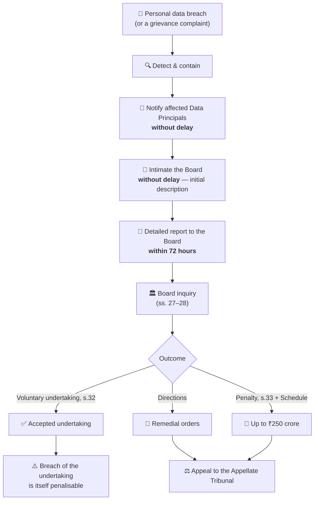
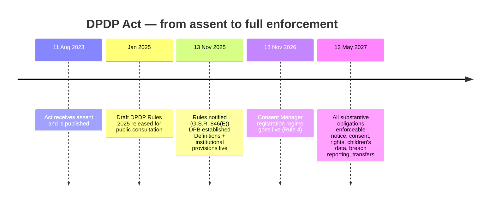

# 🇮🇳 Digital Personal Data Protection Act, 2023 — Complete Summary & GRC Analysis


-green)


> **Author:** Himanadh Sesha Sai. Inampudi · Btech .  Uttaranchal University · Batch of 2028
> **Focus:** Cybersecurity — AI Security & Governance (GRC) · **Last updated:** 03 October 2026
> **Connect:** <a href="https://www.linkedin.com/in/himanadh-sesha-sai-inampudi-410b88316">  </a> <a href="https://github.com/Himanadh08">  </a> <a href="mailto:sshimanadh08@gmail.com">  </a>

> **What this document is:** a plain-English study + practice guide to India's first comprehensive data
> protection law, written for students and freshers who are new to privacy, and structured the way a
> GRC (Governance, Risk & Compliance) analyst would actually read it — with a summary, a risk register,
> a compliance checklist, a GDPR comparison, a glossary and interview questions.
>
> **Read time:** ~35 minutes for a full pass · ~10 minutes for the cheat sheet.

---

## 📑 Table of Contents

- [Part 0 — Cheat Sheet (read this first)](#part-0--cheat-sheet-read-this-first)
- [Part 1 — Summary of the DPDP Act, 2023](#part-1--summary-of-the-dpdp-act-2023)
  - [1.1 The 30-second version](#11-the-30-second-version)
  - [1.2 Why India needed this Act](#12-why-india-needed-this-act)
  - [1.3 How the law came to be — timeline](#13-how-the-law-came-to-be--timeline)
  - [1.4 The 6 words that unlock the whole Act](#14-the-6-words-that-unlock-the-whole-act)
  - [1.5 Who does it apply to? (Scope & extraterritorial reach)](#15-who-does-it-apply-to-scope--extraterritorial-reach)
  - [1.6 The two lawful bases: Consent & Legitimate Uses](#16-the-two-lawful-bases-consent--legitimate-uses)
  - [1.7 Rights of the Data Principal](#17-rights-of-the-data-principal)
  - [1.8 Duties of the Data Principal](#18-duties-of-the-data-principal)
  - [1.9 Obligations of a Data Fiduciary](#19-obligations-of-a-data-fiduciary)
  - [1.10 Significant Data Fiduciary (SDF) — the "higher tier"](#110-significant-data-fiduciary-sdf--the-higher-tier)
  - [1.11 Children's data & persons with disability](#111-childrens-data--persons-with-disability)
  - [1.12 Cross-border transfers](#112-cross-border-transfers)
  - [1.13 Exemptions](#113-exemptions)
  - [1.14 The Data Protection Board of India](#114-the-data-protection-board-of-india)
  - [1.15 Penalties — the Schedule to the Act](#115-penalties--the-schedule-to-the-act)
  - [1.16 Section map at a glance](#116-section-map-at-a-glance)
- [Part 2 — DPDP Rules, 2025](#part-2--dpdp-rules-2025)
  - [2.1 What the Rules add](#21-what-the-rules-add)
  - [2.2 The phased rollout calendar](#22-the-phased-rollout-calendar)
  - [2.3 Breach notification: the 72-hour clock](#23-breach-notification-the-72-hour-clock)
  - [2.4 Retention, erasure & logging](#24-retention-erasure--logging)
  - [2.5 Children's data under the Rules](#25-childrens-data-under-the-rules)
  - [2.6 Consent Managers under the Rules](#26-consent-managers-under-the-rules)
- [Part 3 — GRC Analysis](#part-3--grc-analysis)
  - [3.1 Governance: who owns what](#31-governance-who-owns-what)
  - [3.2 Risk Register](#32-risk-register)
  - [3.3 Compliance Checklist (phased)](#33-compliance-checklist-phased)
  - [3.4 Control mapping: obligation → control → evidence](#34-control-mapping-obligation--control--evidence)
  - [3.5 DPDP vs GDPR — the comparison table](#35-dpdp-vs-gdpr--the-comparison-table)
  - [3.6 Penalty exposure: how a fine is actually built](#36-penalty-exposure-how-a-fine-is-actually-built)
  - [3.7 Glossary](#37-glossary)
  - [3.8 Interview questions for freshers](#38-interview-questions-for-freshers)
- [Part 4 — Diagrams](#part-4--diagrams)
- [Part 5 — Evidence & Verification Log](#part-5--evidence--verification-log)
- [Part 6 — Sources](#part-6--sources)
- [Disclaimer](#disclaimer)

---

## Part 0 — Cheat Sheet (read this first)

If you remember nothing else, remember these twelve lines.

| # | Fact | Why it matters |
|---|---|---|
| 1 | India's **first** standalone data protection law. Presidential assent **11 August 2023**. | Replaces the old "IT Act + SPDI Rules" patchwork. |
| 2 | It governs **digital personal data**. | Paper records are out of scope. |
| 3 | Two lawful bases only: **Consent** (s.6) **or Legitimate Use** (s.7). | No "legitimate interest" balancing test like GDPR. |
| 4 | The individual is the **Data Principal**; the decision-maker is the **Data Fiduciary**. | Learn these two words — everything hangs off them. |
| 5 | Consent must be **free, specific, informed, unconditional, unambiguous**, by clear affirmative action. | Pre-ticked boxes and bundled consent are dead. |
| 6 | **A child = anyone under 18.** Verifiable parental consent is mandatory. | India's child threshold is stricter than GDPR's 16. |
| 7 | **Behavioural monitoring / targeted ads aimed at children are banned.** | Applies to ed-tech, gaming, social media. |
| 8 | Cross-border transfer is allowed **unless** a country is on a notified blacklist (s.16). | Default-allow model, not GDPR's default-deny. |
| 9 | Breach: intimate the Board **without delay** + detailed report within **72 hours**; tell affected people **without delay**. | Incident response must be rehearsed before, not during. |
| 10 | Max penalty: **₹250 crore** for a security-safeguards failure. | ₹200 cr (breach notice) · ₹200 cr (children) · ₹150 cr (SDF). |
| 11 | Enforcement body: **Data Protection Board of India (DPB)**, established **13 Nov 2025**. | Digital-first regulator, headquartered in the NCR. |
| 12 | Rules notified **13 Nov 2025**; full substantive compliance by **13 May 2027**. | Three-phase rollout = your study/practice roadmap. |

**The one sentence summary:**
> *If you process digital personal data in India, you must have a lawful basis, tell people what you're doing, secure and delete it properly, honour their rights, report breaches fast, and answer to a regulator that can fine you up to ₹250 crore.*

---

## Part 1 — Summary of the DPDP Act, 2023

### 1.1 The 30-second version

The **Digital Personal Data Protection Act, 2023** ("DPDP Act") is an Act of the Indian Parliament that sets out **how digital personal data may be processed** — collected, stored, used, shared, and erased — in a way that respects both:

1. the **right of individuals to protect their personal data**, and
2. the **need to process personal data for lawful purposes**.

It does this by creating a small set of clearly-defined roles, a **consent-first** lawful basis, a list of **non-consensual "legitimate uses"**, enforceable **rights** for individuals, **obligations** graded by risk, a dedicated **regulator**, and one of the **strictest penalty schedules in the world** [MeitY — Act text](https://www.meity.gov.in/static/uploads/2024/06/2bf1f0e9f04e6fb4f8fef35e82c42aa5.pdf).

### 1.2 Why India needed this Act

Before the DPDP Act, India's privacy rules were scattered and indirect:

- **Information Technology Act, 2000** — a few thin provisions, no modern consent architecture.
- **SPDI Rules, 2011** — applied only to a narrow list of "sensitive personal data" and only to body corporates.
- **Puttaswamy judgment (2017)** — the Supreme Court held that privacy is a **fundamental right** under Article 21, and called for a data protection law.
- **Draft Personal Data Protection Bill, 2019** — withdrawn in 2022 after heavy criticism and 81 recommended changes.

The DPDP Act is the outcome. It is deliberately **shorter and simpler** than GDPR — 44 sections and a Schedule, written in plainer language, with most of the operational detail pushed into the **DPDP Rules, 2025** [DLA Piper — Data protection laws in India](https://www.dlapiperdataprotection.com/?t=law&c=IN).

### 1.3 How the law came to be — timeline

| Date | Milestone |
|---|---|
| Aug 2017 | **Puttaswamy** — privacy recognised as a fundamental right. |
| Dec 2019 | Personal Data Protection Bill, 2019 introduced. |
| Aug 2022 | Bill withdrawn; a slimmer draft released for consultation. |
| **11 Aug 2023** | **DPDP Act, 2023** published after receiving assent. |
| Jan 2025 | **Draft DPDP Rules, 2025** published for public consultation. |
| **13 Nov 2025** | **DPDP Rules, 2025 notified** (Gazette G.S.R. 846(E)); **Data Protection Board of India established**; Phase 1 provisions commence. |
| 14 Nov 2025 | PIB formally announces the Rules to the public. |
| **13 Nov 2026** | Phase 2 — Consent Manager registration regime goes live. |
| **13 May 2027** | Phase 3 — **all substantive obligations** become enforceable. |

Sources: [AZB & Partners — Phased rollout](https://www.azbpartners.com/bank/indias-digital-personal-data-protection-act-phased-rollout-and-key-compliance-milestones/), [Tsaaro — DPDP Rules 2025 explained](https://tsaaro.com/blogs/dpdp-rules-2025-explained-full-overview-and-practical-summary), [PIB](https://www.pib.gov.in/PressReleasePage.aspx?PRID=2190655).

> **Note on dates:** the Rules were *notified* on **13 November 2025**; PIB's public press release is dated 14 November 2025. Both dates are seen in the wild — 13 Nov is the legally operative notification date.

### 1.4 The 6 words that unlock the whole Act

Learn these six definitions and 70% of the Act becomes obvious.

| Term | Definition | Plain English |
|---|---|---|
| **Data Principal** | *"the individual to whom the personal data relates and where such individual is— (i) a child, includes the parents or lawful guardian of such a child; (ii) a person with disability, includes her lawful guardian, acting on her behalf"* | **The person the data is about.** This is the "data subject" of GDPR, renamed. |
| **Data Fiduciary** | *"any person who alone or in conjunction with other persons determines the purpose and means of processing of personal data"* | **The decision-maker.** Decides *why* and *how* data is processed. Roughly = GDPR's "controller". |
| **Significant Data Fiduciary (SDF)** | *"any Data Fiduciary or class of Data Fiduciaries as may be notified by the Central Government under section 10"* | **A high-risk fiduciary.** Extra duties: DPO, audits, DPIAs. |
| **Consent Manager** | *"a person registered with the Board, who acts as a single point of contact to enable a Data Principal to give, manage, review and withdraw her consent through an accessible, transparent and interoperable platform"* | **A consent middleman.** One dashboard for all your consents. Unique to India — GDPR has no equivalent. |
| **Data Processor** | A person who processes personal data **on behalf of** a Data Fiduciary *(paraphrase)* | **The vendor.** Your cloud provider, payroll SaaS, CRM. Acts on instructions only. |
| **Personal Data Breach** | A breach of security leading to accidental or unlawful destruction, loss, alteration, or unauthorised disclosure of / access to personal data *(paraphrase)* | **Anything that leaks or corrupts personal data** — hacked, emailed to the wrong person, laptop stolen, ransomware. |

> ✅ The four bracketed **verbatim** definitions above are quoted directly from the official Act text
> [MeitY PDF](https://www.meity.gov.in/static/uploads/2024/06/2bf1f0e9f04e6fb4f8fef35e82c42aa5.pdf).
> The two marked *(paraphrase)* are simplified working definitions — always check the official text
> before quoting them in an exam or an audit.

### 1.5 Who does it apply to? (Scope & extraterritorial reach)

**Section 3 (Application of the Act)** makes the Act apply to digital personal data processed:
- **within the territory of India**, and
- **outside India**, where the processing is in connection with **profiling or offering goods or services to Data Principals within India**.

Practical translation for a fresher:

- The Act follows **the data, not the company's address**. A US SaaS company with Indian users is caught.
- **Non-digital / paper records are out of scope** — this is a *digital* personal data law.
- Personal or domestic processing by an individual is generally out of scope.
- Publicly available personal data is still personal data — **"public" ≠ "free to use"**.

> **India Code** lists the Act's opening sections as *Section 1 – Short title and commencement*, *Section 2 – Definitions*, *Section 3 – Application of Act*
> [India Code](https://indiacode.gov.in/act/c058fa9f-eaf0-4ca3-98f1-3443b087bca9/sections).

### 1.6 The two lawful bases: Consent & Legitimate Uses

**Section 4** sets the ground rule: personal data may be processed only for a **lawful purpose** and only with (a) the **consent** of the Data Principal or (b) for a **legitimate use**.

#### (a) Consent — Section 6

Consent must be **free, specific, informed, unconditional and unambiguous**, with a **clear affirmative action**. It must be limited to the personal data **necessary** for the specified purpose.

Under Section 6, the Data Principal also has:
- the **right to withdraw** consent at any time (as easily as it was given),
- the **right to know** about the processing, and
- the ability to make a complaint to the Board.

**What fails the test in practice:**

| Anti-pattern | Why it fails |
|---|---|
| Pre-ticked checkbox | Not a clear affirmative action. |
| "By continuing to use this app you agree…" | Not specific, not unambiguous. |
| Bundled consent (marketing + core service) | Not free; not unconditional. |
| Dark-pattern withdrawal (easy to give, hard to take back) | Breaches the withdrawal guarantee. |
| Consent for an infinite/undefined purpose | Not specific. |

#### (b) Legitimate Uses — Section 7

No consent is needed where processing is for one of these recognised purposes (the "legitimate uses"):

1. The Data Principal has **voluntarily provided** the data and has not indicated she does not want it processed, **for a specified purpose**.
2. Processing by the **State** for subsidies, benefits, services, certificates, licences or permits issued under law.
3. Fulfilling a **legal obligation** or complying with a **judgment/order**.
4. **Medical emergency**, epidemic, disaster or other emergency.
5. **Employment** purposes — safeguards, safety, health, recruitment, termination, etc.

> **Exam trap:** legitimate uses are **not** a GDPR-style "legitimate interest" balancing test. They are a **closed list**. If your purpose isn't on it, you need consent.

### 1.7 Rights of the Data Principal

| Section | Right | What a company must actually build |
|---|---|---|
| **s.11** | **Right to access information** — a summary of the personal data processed, and the identities of all fiduciaries with whom it was shared | A self-service "what do you have on me?" page + data map |
| **s.12** | **Right to correction and erasure** | Profile edit, correction workflow, deletion workflow with downstream propagation |
| **s.13** | **Right of grievance redressal** | A published grievance channel + a **readily available response** before going to the Board |
| **s.14** | **Right to nominate** | A "nominee" field for the event of death / incapacity |

**Grievance redressal is the gate to the regulator.** Under **Section 8(10)**, a Data Fiduciary must *"establish an effective mechanism to redress the grievances of Data Principals."* In practice, a Data Principal is expected to exhaust this route before the Board takes up a complaint.

> ⚠️ **Not in the Act:** there is **no right to data portability** and no explicit right to object to automated decision-making. Know what the Indian law *doesn't* give you — interviewers love this question.

### 1.8 Duties of the Data Principal

Yes — rights come with duties (**Section 15**). A Data Principal must:

- comply with the Act when exercising rights,
- not provide **false or frivolous** information,
- not file a **false or frivolous complaint** to the Board,
- furnish **only authentic** information while exercising the right to correction.

**Penalty for breaching these duties: up to ₹10,000.** It's tiny, but it exists — and it's the reason the Schedule has seven rows, not six.

### 1.9 Obligations of a Data Fiduciary

**Section 8** is the workhorse of the Act. Here's the obligations table you'd put in a policy document:

| Ref | Obligation | GRC translation |
|---|---|---|
| s.8(1) | Be **responsible** for compliance, regardless of any agreement or any failure of the Data Principal | Controller remains liable; vendor risk is your risk |
| s.8(2) | Engage a **Data Processor only under a valid contract** | DPA register with every vendor |
| s.8(3) | Ensure **completeness, accuracy and consistency** where data is used for a decision or shared | Data quality controls |
| s.8(4) | Implement appropriate **technical and organisational measures** to ensure compliance | Policies, controls, training |
| **s.8(5)** | Take **reasonable security safeguards** to prevent a personal data breach | The ₹250 crore obligation — ISO 27001, encryption, access control |
| **s.8(6)** | Give **notice of a personal data breach** to the Board *and* each affected Data Principal | Incident response + 72-hour reporting |
| s.8(7) | **Erase** data when consent is withdrawn or the purpose is no longer served, unless retention is legally required | Retention schedule + withdrawal → deletion pipeline |
| s.8(8) | Purpose is deemed **no longer served** when the Data Principal stops engaging for the prescribed period (e.g. the Rules' time limits) | Inactivity-based purge rules |
| s.8(9) | Publish **business contact details** of a DPO or a person who can answer questions about processing | Privacy notice / website footer |
| s.8(10) | Establish an **effective mechanism to redress grievances** | Documented, measured, published; ticketing SLA |

**Notice (Section 5):** before or at the time of requesting consent, the Data Principal must be given a notice describing the personal data, the purpose, and the manner of exercising rights and complaining to the Board.

### 1.10 Significant Data Fiduciary (SDF) — the "higher tier"

**Section 10(1)** lets the Central Government notify any Data Fiduciary or class of Data Fiduciaries as a **Significant Data Fiduciary**, based on factors such as:

- the **volume and sensitivity** of personal data processed,
- the **risk to the rights** of Data Principals,
- the **potential impact on the sovereignty and integrity of India**,
- **risk to electoral democracy**, **security of the State**, and **public order**.

**Additional obligations of an SDF (Section 10(2)):**

1. Appoint a **Data Protection Officer (DPO)** who is **based in India** and **reports to the board of directors** of the SDF.
2. Appoint an **independent data auditor** to evaluate compliance.
3. Carry out **periodic Data Protection Impact Assessments (DPIAs)** and audits.
4. Undertake **other prescribed measures**, including algorithmic due diligence.

> Think of the SDF tier as India's version of "high-risk processing" — but triggered by **government notification**, not a self-assessment.

### 1.11 Children's data & persons with disability

**Section 9** is short, strict and high-penalty:

- Before processing the personal data of a **child** (under 18) or of a person with a disability who has a lawful guardian, the fiduciary must obtain **verifiable consent** of the parent / lawful guardian, in the prescribed manner.
- **Behavioural monitoring** and **behavioural advertising directed at children are prohibited.**
- **Tracking or targeting advertising at children is prohibited.**
- Processing that is **detrimental to the well-being of a child** is prohibited.

**Section 9(4)** allows the Government to exempt certain classes of fiduciary (e.g. health services, educational institutions) from specific child-related obligations by prescribing standards.

**Under the Rules (Rule 10)**, "verifiable" is doing real work: fiduciaries must use **age-verification** methods to determine who is a child, and **parent-authentication** methods (reliable identity information, government-issued ID, or a virtual token mapped to such ID) to confirm the consenting adult is the parent/guardian [Tsaaro](https://tsaaro.com/blogs/dpdp-rules-2025-explained-full-overview-and-practical-summary).

> **Design implication:** if your product is used by children, you need a real age-gate, a parental consent flow, and a hard switch that turns off behavioural ads and profiling for minors.

### 1.12 Cross-border transfers

**Section 16** gives the Central Government the power, **by notification**, to **restrict the transfer of personal data** to such country or territory outside India as may be notified.

**The model — and why it matters:**

| | **India (DPDP)** | **EU (GDPR)** |
|---|---|---|
| Default posture | **Allow** — transfers permitted unless a destination is notified as restricted | **Deny** — transfers permitted only with adequacy / SCCs / BCRs |
| Mechanism | Negative-list notification by Government | Positive-list of adequacy decisions + contractual instruments |

**Fresher takeaway:** India starts permissive and can tighten country-by-country. That's a fundamentally different engineering assumption from GDPR's "no transfer without a mechanism."

### 1.13 Exemptions

**Section 17** carves out situations where large parts of the Act do not apply. The exemptions verified from the Act text include processing necessary for:

- **enforcing any legal right or claim**,
- **judicial or regulatory functions** of courts, tribunals or regulatory bodies,
- **prevention, detection, investigation or prosecution** of offences,
- processing of personal data of Data Principals **outside India** pursuant to a contract with a person outside India by a person based in India,
- **mergers, amalgamations or restructuring** approved by a competent authority,
- ascertaining the **financial information of a loan defaulter**.

**Section 17(2)** also allows the Central Government to exempt specified **instrumentalities of the State** in the interests of the **sovereignty and integrity of India, security of the State, friendly relations with foreign States, maintenance of public order, or preventing incitement to a cognisable offence**.

**Which parts are switched off in many exemptions?** The Act text says these provisions **shall not apply**: **Chapter II** (except sub-sections (1) and (5) of section 8), **Chapter III** (Data Principal rights and duties) and **section 16** (cross-border). Note carefully: **the security obligation in s.8(5) is preserved even in exemptions** — a deliberate design choice.

### 1.14 The Data Protection Board of India

Established by notification on **13 November 2025** under the Act, with its **head office in the National Capital Region**, and constituted with **four members at inception**. The DPB functions as a **digital-first** regulator empowered to:

- **receive breach notifications**,
- **conduct inquiries** into breaches of the Act and Rules,
- **issue directions**,
- **accept voluntary undertakings** (Section 32),
- **impose monetary penalties** (Section 33 + Schedule).

Sections **18–26** contain the institutional provisions (constitution, appointments, terms, salary, removal, etc.), and **Section 27** sets out the Board's powers and functions. Appeals from Board orders lie to the **Appellate Tribunal** (the Rules prescribe the appeal mechanics — see Rule 22). Source: [AZB & Partners](https://www.azbpartners.com/bank/indias-digital-personal-data-protection-act-phased-rollout-and-key-compliance-milestones/).

**A useful nuance for interviews:** the DPB is framed as a **digital-first adjudicatory body**, not a consultative/rulemaking privacy authority like the EU's data protection authorities. It adjudicates; the Government makes rules.

### 1.15 Penalties — the Schedule to the Act

Section 33 read with the Schedule creates the penalty regime. These figures are **verbatim from the Act text**:

| # | Breach | Maximum penalty |
|---|---|---|
| 1 | Breach of the obligation of a Data Fiduciary to take **reasonable security safeguards** to prevent a personal data breach — **s.8(5)** | **₹250 crore** |
| 2 | Breach of the obligation to give the Board or an affected Data Principal **notice of a personal data breach** — **s.8(6)** | **₹200 crore** |
| 3 | Breach of the **additional obligations in relation to children** — **s.9** | **₹200 crore** |
| 4 | Breach of the **additional obligations of a Significant Data Fiduciary** — **s.10** | **₹150 crore** |
| 5 | Breach of the **duties** of a Data Principal — **s.15** | **₹10,000** |
| 6 | Breach of any term of a **voluntary undertaking** accepted by the Board — **s.32** | Up to the extent applicable for the original breach (under s.28 proceedings) |
| 7 | Breach of **any other provision** of the Act or the Rules | **₹50 crore** |

Source: Schedule, DPDP Act 2023 [MeitY PDF](https://www.meity.gov.in/static/uploads/2024/06/2bf1f0e9f04e6fb4f8fef35e82c42aa5.pdf).

**Reading the penalty table like a GRC analyst:**

- These are **maxima, not tariffs**. The actual fine depends on the nature, gravity, duration of the breach, and whether the fiduciary took remedial action.
- The **two biggest numbers both attach to security and speed** (protect the data; tell people fast). That tells you where to spend your budget.
- The Schedule has **no "per-record" multiplying factor** and **no percentage-of-turnover multiplier** — unlike GDPR's €20m/4% formula. An Indian fine is a **fixed ceiling**.
- **s.8(5) survives exemption** (see 1.13) — security is treated as non-negotiable.

### 1.16 Section map at a glance

| Sections | Theme |
|---|---|
| 1–3 | **Preliminary** — short title & commencement, definitions, application of the Act |
| 4–10 | **Chapter II — Obligations of a Data Fiduciary** — grounds for processing, notice, consent, legitimate uses, general obligations, children, SDF |
| 11–15 | **Chapter III — Rights and Duties of the Data Principal** — access, correction & erasure, grievance redressal, nomination, duties |
| 16–17 | **Special provisions** — cross-border transfer, exemptions |
| 18–26 | **Data Protection Board of India** — establishment and institutional provisions |
| 27–34 | Powers and functions of the Board, proceedings, voluntary undertaking, penalties and adjudication |
| 35–44 | Miscellaneous — good-faith protection, power to call for information, blocking, overriding effect, bar on civil courts, rule-making, removal of difficulties, and amendments to other Acts |

> Chapter groupings for ss.4–15 are **confirmed by the Act's own cross-references**: Section 17 says
> *"the provisions of Chapter II, except sub-sections (1) and (5) of section 8, and those of Chapter III and section 16 shall not apply…"*.
> Headings for the later chapters are given for orientation — confirm exact titles at
> [India Code](https://indiacode.gov.in/act/c058fa9f-eaf0-4ca3-98f1-3443b087bca9/sections).

---

## Part 2 — DPDP Rules, 2025

The Act paints in broad strokes; the **Rules** supply the operational detail. Notified **13 November 2025** after a consultation that drew **6,915 public inputs**.

### 2.1 What the Rules add

The Rules convert principles into testable procedures: the **manner of notice**, **security safeguard standards**, **breach notification mechanics**, **retention and erasure timelines**, **verifiable parental consent methods**, **SDF obligations**, **cross-border requirements**, **how rights are exercised**, **appeal procedure**, and the Government's **information-calling powers**.

Verification note: the **themes** below are confirmed from law-firm trackers; **specific rule numbers** are flagged. Where a rule number is not independently confirmed, the topic is described rather than numbered.

| Rule / range | Subject | Confirmation |
|---|---|---|
| **Rules 1–2** | Commencement and definitions | ✅ Listed in Phase 1 |
| **Rule 3** | Manner of providing **notice** to Data Principals | ✅ Theme |
| **Rule 4** | **Registration and obligations of Consent Managers** | ✅ Phase 2 rule (13 Nov 2026) |
| **Rules 5–16** | Substantive requirements — security safeguards, breach notification, retention & erasure, verifiable parental consent, children exemptions, SDF obligations, cross-border transfers, exercise of rights | ✅ Range |
| **Rule 7** | **Intimation of a personal data breach** to the Board and to Data Principals | ✅ Rule number |
| **Rule 10** | **Verifiable parental consent** (age verification + parent authentication) | ✅ Rule number |
| **Rules 17–21** | **Data Protection Board** — constitution, functioning and operations | ✅ Phase 1 |
| **Rule 22** | **Appeal to the Appellate Tribunal** | ✅ Theme |
| **Rule 23** | Central Government's power to **call for information** from fiduciaries/intermediaries | ✅ Theme |

### 2.2 The phased rollout calendar

Notifications dated **13 November 2025** operationalised the Act and Rules in **three stages**, with the final substantive deadline at **eighteen months** — i.e. **May 2027**.

| Stage | Effective date | What comes alive |
|---|---|---|
| **Phase 1 — Immediate** | **13 Nov 2025** | **Act:** ss.1(2), 2, 18–26, 35, 38–43, 44(1) & (3) — definitions, DPB institutional provisions, good-faith protection, overriding effect, bar on civil-court jurisdiction, rule-making power. **Rules:** 1, 2, 17–21 — procedural framework and DPB operation. |
| **Phase 2 — +1 year** | **13 Nov 2026** | **Act:** s.6(9) and s.27(1)(d) — Consent Manager registration. **Rules:** Rule 4 — registration and obligations of Consent Managers. |
| **Phase 3 — +18 months** | **13 May 2027** | **Act:** ss.3–5, 6(1)–(8) & (10), 7–17, 27 (except 27(1)(d)), 28–34, 36–37, 44(2) — **the entire compliance core**: notice, consent, legitimate uses, obligations, children's data, Data Principal rights & duties, exemptions, cross-border transfers, Government information & blocking powers, Board powers and penalties. **Rules:** 3, 5–16, 22, 23. |

Sources: [AZB & Partners](https://www.azbpartners.com/bank/indias-digital-personal-data-protection-act-phased-rollout-and-key-compliance-milestones/), [Tsaaro](https://tsaaro.com/blogs/dpdp-rules-2025-explained-full-overview-and-practical-summary).

`⚠️ Minor source discrepancy:` law-firm trackers state Phase 2 as *12 November 2026* and Phase 3 as *12 May 2027*, while others compute from the notification date to *13 November 2026* and *13 May 2027*. Both refer to the same "one year / eighteen months from notification" milestones. Treat **18 months from 13 Nov 2025** as the operative trigger and check the Gazette for the exact date.

**Why the phasing matters to you as a fresher:** from now until May 2027, organisations are in **implementation mode**. That means **documentation, data mapping, consent redesign and vendor contracting projects are live right now** — and those are precisely the tasks handed to graduates joining privacy and GRC teams. This is the most employable window this law will ever have.

### 2.3 Breach notification: the 72-hour clock

The Rules make the breach obligation concrete (**Rule 7**). On becoming aware of a personal data breach, a Data Fiduciary must:

1. **Intimate each affected Data Principal** — *without delay*, to the best of its knowledge, in a **concise, clear and plain manner**, through their user account or registered communication mode.
2. **Intimate the Data Protection Board** — *without delay*, with an **initial description** of the breach.
3. **File a detailed report with the Board** — within **72 hours** of becoming aware of the breach, or within such longer period as the Board may allow on a **written request**.

Sources: [Tsaaro](https://tsaaro.com/blogs/dpdp-rules-2025-explained-full-overview-and-practical-summary), [DPDPA Edu — Rule 7](https://dpdpaedu.org/docs/DPDPA%20Rules/Intimation%20of%20Personal%20Data%20Breach/).

**Note the architecture:** India runs a **two-clock, two-audience** model — a *no-delay* obligation to humans and to the regulator, plus a *72-hour* detailed filing. That is different from GDPR's single 72-hour authority notification plus a separate "without undue delay" duty to individuals.

> **Ops checklist for the 72 hours:** severity triage → containment → affected-population scoping → initial Board intimation → plain-language notice to individuals → forensic timeline → detailed report → lessons learned → control remediation. Rehearse it as a tabletop exercise; you will not invent it during an incident.

### 2.4 Retention, erasure & logging

The Rules add hard numbers to the Act's "erase when the purpose is served" principle:

| Requirement | Detail |
|---|---|
| **Longer retention for large platforms** | **E-commerce entities and social media intermediaries** with **≥ 2 crore registered Indian users**, and **online gaming intermediaries** with **≥ 50 lakh registered users**, must retain specified personal data for **three years** from the date of last interaction (or commencement of the Rules, whichever is later) |
| **Advance notice before erasure** | At least **48 hours** before the end of the applicable retention period, the fiduciary must inform the Data Principal |
| **Baseline logging** | A Data Fiduciary must retain personal data, associated **traffic data** and other **logs of processing** (whether processed by it or on its behalf by a processor) for a **minimum of one year** |

Source: [Tsaaro](https://tsaaro.com/blogs/dpdp-rules-2025-explained-full-overview-and-practical-summary).

**Why this trio is a GRC gift:** it makes retention **auditable**. You now need a retention matrix, a scheduled-purge job with logs, and evidence that the 48-hour notice was sent — three clean controls you can point to in an audit.

### 2.5 Children's data under the Rules

- **Verifiable parental consent is a real gate**, not a checkbox. Fiduciaries must deploy **age-verification** (to identify who is a child) and **parent-authentication** (reliable identity data, government-issued ID, or a **virtual token** mapped to such ID).
- The level of assurance should be **appropriate to the risk**.
- **Behavioural monitoring, behavioural advertising and profiling of children remain prohibited**; the Rules prescribe the exemption route for legitimate classes (e.g. health, education) with prescribed standards.

Source: [Tsaaro](https://tsaaro.com/blogs/dpdp-rules-2025-explained-full-overview-and-practical-summary).

### 2.6 Consent Managers under the Rules

Consent Manager registration goes live **13 November 2026** (Rule 4). From the First Schedule (Part A):

| Requirement | Detail |
|---|---|
| Eligibility | Only **Indian companies** may apply |
| Capability | Demonstrated **technical, operational and financial** strength |
| **Minimum net worth** | **₹2 crore** |
| Disclosures | Extensive disclosure of **promoters, directors, key managerial personnel and significant shareholders** |
| Governance | Structure supporting integrity, transparency and operations **free from conflicts of interest** |
| Obligations | Act as a **single point of contact** for giving, managing, reviewing and withdrawing consent via an **accessible, transparent and interoperable** platform |

Source: [Tsaaro](https://tsaaro.com/blogs/dpdp-rules-2025-explained-full-overview-and-practical-summary).

---

## Part 3 — GRC Analysis

**GRC = Governance, Risk, Compliance.** Governance = who decides and who is accountable. Risk = what could go wrong and how you treat it. Compliance = proving you did what the law requires. This part is written so you can drop it straight into a privacy programme or an interview answer.

### 3.1 Governance: who owns what

#### A. Three lines of defence for a DPDP programme

| Line | Role | DPDP-specific mandate |
|---|---|---|
| **1st line** | Business & product teams | Collect only what's necessary; implement consent UI, retention jobs, deletion workflows |
| **2nd line** | Privacy/GRC/DPO office | Policy, DPIA, vendor due diligence, training, breach playbook, Board interface |
| **3rd line** | Internal audit / independent data auditor | Independent assurance; **mandatory for an SDF** under s.10(2) |

#### B. Statutory roles created by the Act

| Role | Required of | Key legal detail |
|---|---|---|
| **Data Protection Officer (DPO)** | **Significant Data Fiduciaries** | Must be **based in India** and **report to the board of directors** (s.10(2)) |
| **Independent Data Auditor** | SDFs | Evaluates the SDF's compliance posture |
| **Contact person for Data Principals** | **Every Data Fiduciary** | Name/contact details for answering questions about processing must be **published** (s.8(9)) |
| **Grievance redressal officer / mechanism** | Every Data Fiduciary | *"Effective mechanism to redress the grievances"* (s.8(10)) |
| **Consent Manager** | Registered entity | Single point of contact for consent lifecycle; ≥ ₹2 crore net worth |
| **Data Protection Board of India** | Statutory regulator | Four members at inception; NCR headquarters; adjudicates, directs, fines |

#### C. RACI for the top five compliance workstreams

| Workstream | Accountable | Responsible | Consulted | Informed |
|---|---|---|---|---|
| Consent & notice design | Chief Product Officer | Product + Legal | DPO, UX | Board/Exec |
| Data mapping & RoPA | DPO | Privacy ops | Engineering, Procurement | CISO, Exec |
| Breach response | CISO | IR team | DPO, Legal, Comms | Board, DPB, Data Principals |
| Vendor/processor governance | Head of Procurement | Vendor risk | DPO, Legal | CFO, Exec |
| Rights fulfilment (access/correction/erasure/nominate) | Head of CX | Support ops + Eng | DPO | Data Principal |

#### D. Governance artefacts you should be able to name

Privacy policy · Data retention & deletion policy · Consent management standard · DPIA methodology · Breach response plan · Processor contract (DPA) template · Grievance SOP · Records of processing · Training & awareness records · Board-level privacy dashboard.

### 3.2 Risk Register

Format: **L** = Likelihood (1–5), **I** = Impact (1–5), **S** = Score (L×I). Anything ≥ 12 is a priority treatment.

| ID | Risk | Linked obligation | L | I | S | Treatment | Owner |
|---|---|---|---|---|---|---|---|
| R-01 | **Inadequate security safeguards** leading to a data breach | s.8(5) · Penalty up to **₹250 cr** | 3 | 5 | **15** | ISO 27001 / SOC 2 controls; encryption at rest & in transit; least privilege; quarterly pen tests | CISO |
| R-02 | **Delayed or defective breach notification** to Board / Data Principals | s.8(6) · Rule 7 · up to **₹200 cr** | 3 | 5 | **15** | 72-hour playbook; on-call roster; pre-drafted notice templates; tabletop exercises twice a year | CISO + DPO |
| R-03 | **Children's data processed without verifiable parental consent**, or behavioural ads served to minors | s.9 · Rule 10 · up to **₹200 cr** | 4 | 4 | **16** | Age-gate + parent authentication; hard-disable behavioural ads/profiling for under-18s; annual audit of child-directed surfaces | CPO |
| R-04 | **SDF-tier obligations triggered but unmet** (no India-based DPO, no DPIA, no auditor) | s.10 · up to **₹150 cr** | 3 | 4 | **12** | Monitor Government notifications; pre-appoint India-resident DPO; annual DPIA + independent audit cycle | DPO |
| R-05 | **Consent architecture is invalid** (bundled, pre-ticked, no granularity, hard withdrawal) | s.6 | 4 | 4 | **16** | Consent redesign; granular purpose-level toggles; withdrawal in ≤ same number of clicks | CPO + Legal |
| R-06 | **No lawful basis for a processing purpose** (purpose not on the legitimate-use list) | ss.4, 7 | 3 | 4 | **12** | Purpose-by-purpose lawful-basis matrix; block launch until basis recorded | Legal |
| R-07 | **Indefinite retention / failure to erase after purpose is served or consent withdrawn** | s.8(7) · Rules retention limits | 4 | 3 | **12** | Retention matrix with per-category periods; automated purge jobs with logs; 48-hour pre-erasure notice | Privacy Ops |
| R-08 | **Shadow data / incomplete data mapping** — unknown flows to unknown vendors | ss.8(1), 8(2) | 4 | 3 | **12** | Annual data-discovery sweep; vendor register; DPA with every processor | Privacy Ops + Procurement |
| R-09 | **Data Principal rights requests missed or mishandled** | ss.11–14, 8(10) | 4 | 3 | **12** | DSAR tooling; 30-day internal SLA; audit trail per request | CX Lead |
| R-10 | **Cross-border flow hits a notified restricted country** | s.16 | 2 | 4 | **8** | Country-of-storage register; transfer-impact check before any new region; contract clauses | Legal + Cloud Eng |
| R-11 | **Processor breach** — vendor leaks data you remain accountable for | ss.8(1), 8(2) | 3 | 4 | **12** | Vendor security assessments; right-to-audit clauses; breach-notify-me-within-24h clauses | Procurement |
| R-12 | **Regulator information demand / blocking order** cannot be answered | ss.36–37 · Rule 23 | 2 | 4 | **8** | Maintain an evidence pack: policies, logs, DPIAs, consent records | DPO |
| R-13 | **Inadequate records** to demonstrate compliance during a DPB inquiry | s.8(1) + all | 4 | 4 | **16** | Evidence library with version control; quarterly control testing; audit-ready dashboard | DPO + Internal Audit |
| R-14 | **Employee/insider misuse** of personal data | s.8(5) | 3 | 3 | **9** | Access reviews; DLP; mandatory annual privacy training; disciplinary policy | HR + CISO |

**Heat-map logic (copy into a slide):**

```
Impact 5 |        R-01  R-02
Impact 4 |  R-10  R-11  R-04  R-03 R-05 R-13
Impact 3 |        R-14  R-07  R-08 R-09
Impact 2 |
         +----------------------------------
           1    2    3     4     5   Likelihood
```

### 3.3 Compliance Checklist (phased)

Tick these off against the phased calendar. Start at the top — Phase 3 obligations take the longest.

#### ✅ Phase 0 — Do now (pre-Phase 3 readiness)

- [ ] Appoint a **privacy owner** (even part-time) and define the RACI
- [ ] Build a **data inventory / records of processing**: what data, whose, why, where, who can see it, how long
- [ ] Record a **lawful basis** for every processing purpose (consent or a named legitimate use)
- [ ] Classify whether the organisation is likely to be notified as an **SDF**
- [ ] Create an **evidence library** (policies, versions, approvals, training logs)
- [ ] Establish a **vendor/processor register** and standard **data processing agreement**

#### ✅ Phase 1 — Live since 13 Nov 2025

- [ ] Understand DPB constitution and its **adjudicatory powers**
- [ ] Know the **definitions** exactly as the Act defines them (train the teams)
- [ ] Align internal escalation paths to the **DPB as the external authority**

#### ✅ Phase 2 — By 13 Nov 2026

- [ ] If you intend to run a **Consent Manager**: incorporate an Indian company, verify **≥ ₹2 crore net worth**, prepare promoter/director/KMP disclosures, and file for registration
- [ ] Integrate with at least one registered Consent Manager in your consent architecture (optional but strategically useful)
- [ ] Confirm your DPB liaison and appeal path (Appellate Tribunal)

#### ✅ Phase 3 — By 13 May 2027 (the real deadline)

**Consent & notice**
- [ ] Privacy notice states: data collected, purpose, how to exercise rights, how to complain to the Board — in **clear, plain language**
- [ ] Consent is **free, specific, informed, unconditional, unambiguous**, via clear affirmative action
- [ ] Withdrawal is as easy as giving consent and triggers **erasure** unless retention is legally required
- [ ] No bundled consent; no pre-ticked boxes; no dark patterns

**Individual rights**
- [ ] **Access** (s.11): summary of data + list of fiduciaries with whom it was shared
- [ ] **Correction & erasure** (s.12): working workflows with downstream propagation
- [ ] **Grievance redressal** (s.13): published channel with a response SLA
- [ ] **Nomination** (s.14): nominee capture in the account/profile

**Security & incidents**
- [ ] Reasonable security safeguards in place (s.8(5)) — documented, tested, evidenced
- [ ] Breach playbook that delivers: **no-delay** notice to Data Principals, **no-delay** initial intimation to the Board, **detailed report within 72 hours**
- [ ] Tabletop exercise completed and findings closed

**Children**
- [ ] Age-verification in place
- [ ] Verifiable **parental consent** mechanism (reliable ID / government ID / virtual token)
- [ ] Behavioural monitoring and targeted advertising **disabled** for children
- [ ] Exemption route assessed if you are a health/education provider

**Retention & data lifecycle**
- [ ] Per-category **retention schedule**
- [ ] Automated **purge with logs**
- [ ] **48-hour pre-erasure notice** to Data Principals
- [ ] **Minimum one-year** retention of processing logs / traffic data
- [ ] Platform-specific 3-year retention where applicable (e-commerce/social media ≥ 2 crore users; gaming ≥ 50 lakh users)

**SDF-specific (if notified)**
- [ ] India-based **DPO** reporting to the board
- [ ] **Independent data auditor** appointed
- [ ] Periodic **DPIA** and audit completed
- [ ] Algorithmic due diligence documented

**Governance & assurance**
- [ ] Annual training for all handlers of personal data
- [ ] Quarterly control testing with results reported to management
- [ ] Cross-border transfer register and restricted-country monitoring (s.16)
- [ ] Exemption register with legal sign-off for every claimed exemption (s.17)

### 3.4 Control mapping: obligation → control → evidence

This is the table auditors and interviewers respect most, because it closes the loop from **law** to **test**.

| Obligation | Preventive control | Detective control | Evidence artefact |
|---|---|---|---|
| s.5 Notice | Approved notice templates in the consent UI | Random UI audits for notice completeness | Screenshots + template version log |
| s.6 Consent | Purpose-level granular toggles; withdrawal parity | Consent-record sampling; log review | Consent logs with timestamp, purpose, version |
| s.8(3) Accuracy | Validation rules at entry | Data-quality report | Accuracy dashboard |
| s.8(7) Erasure | Automated deletion jobs | Deletion exception report | Purge logs + exception register |
| s.8(5) Security | Encryption, MFA, least privilege, patching | SIEM alerts, pen tests, vulnerability scans | Test reports, patch compliance report |
| s.8(6) Breach notice | Pre-approved templates, on-call roster | 72-hour timer tracking, incident review | Incident file, Board filings, notifications sent |
| s.8(9) Contact details | Publish DPO/contact in privacy notice | Website link check | Published notice + URL |
| s.8(10) Grievance | Ticketing workflow with SLA | SLA breach report | Ticket volume, ageing, resolution metrics |
| s.8(2) Processor contracts | DPA mandatory in procurement gate | Contract register reconciliation | Signed DPAs |
| s.9 Children | Age-gate + parental consent flow | Child-directed surface audit | Consent records, ad-targeting config |
| s.10 SDF duties | DPO + auditor appointed; DPIA calendar | Independent audit report | DPIA reports, board minutes |
| ss.11–14 Rights | Self-service portal | DSAR SLA dashboard | Request/response audit trail |
| s.16 Transfers | Country register + transfer assessment | New-region change control | Transfer register, assessments |
| s.17 Exemptions | Legal sign-off gate | Annual exemption review | Signed exemption memos |

### 3.5 DPDP vs GDPR — the comparison table

| Dimension | **India — DPDP Act, 2023** | **EU — GDPR (Reg. 2016/679)** |
|---|---|---|
| Year | 2023 | 2016 (applicable 2018) |
| Scope | **Digital** personal data; no paper records | **Any** personal data, digital or paper |
| Lawful bases | **Two**: consent; closed list of legitimate uses | **Six**: consent, contract, legal obligation, vital interests, public task, legitimate interests |
| "Legitimate interest" balancing test | ❌ Not available | ✅ Core feature |
| Consent standard | Free, specific, informed, unconditional, unambiguous; clear affirmative action | Freely given, specific, informed, unambiguous (Art. 4(11)) |
| Child threshold | **Under 18** — verifiable parental consent required | **16**, with member states able to lower to **13** (Art. 8) |
| Behavioural ads to children | **Prohibited** | Not outright prohibited; subject to consent and DPIA |
| Data Principal / subject rights | Access, correction & erasure, grievance redressal, nomination | Access, rectification, erasure, restriction, portability, objection, no automated decisions |
| **Data portability** | ❌ Not provided | ✅ Art. 20 |
| Duties on the individual | ✅ Yes — s.15 (penalty up to ₹10,000) | ❌ No statutory duties on the data subject |
| Consent Manager | ✅ Unique to India | ❌ No equivalent |
| Cross-border transfers | **Default allow**, Government may restrict notified countries (s.16) | **Default restrict**; adequacy decisions / SCCs / BCRs / derogations |
| Breach notification | Board: initial intimation **without delay**, detailed report within **72 hours**; Data Principals: **without delay** | Authority: within **72 hours** (Art. 33); subjects: **without undue delay** if high risk (Art. 34) |
| DPO | Mandatory for **Significant Data Fiduciaries**; must be **India-based**, reports to the board | Mandatory for public authorities and certain high-risk processing (Art. 37) |
| DPIA | Mandatory for SDFs (periodic) | Mandatory for high-risk processing (Art. 35) |
| Regulator | **Data Protection Board of India** — single national body, adjudicatory, digital-first | Each member state DPA + EDPB; supervisory and advisory |
| Maximum penalty | **₹250 crore** (fixed ceiling for the worst breach) | **€20 million or 4% of global annual turnover**, whichever is higher |
| Penalty model | Fixed rupee maxima per breach type | Percentage-of-turnover maxima; two-tier (Art. 83) |
| Approach | Short Act (44 sections) + detailed Rules; plainer drafting | Long regulation + extensive recitals and case law |

**How to answer the "compare them" question in one breath:**
> *DPDP is consent-first with a closed list of legitimate uses, treats everyone under 18 as a child, allows cross-border flows by default, creates a unique Consent Manager layer, and uses fixed rupee penalties up to ₹250 crore — whereas GDPR offers six lawful bases including legitimate interests, sets the child threshold at 16, restricts transfers by default, grants portability, and fines as a percentage of global turnover.*

### 3.6 Penalty exposure: how a fine is actually built

A useful mental model when you have to brief management:

```
Exposure = f( obligation breached , severity of the breach , duration ,
              number of Data Principals affected ,
              whether the fiduciary self-reported and remediated ,
              whether a voluntary undertaking was offered ,
              prior compliance history )
       capped at the Schedule maximum for that obligation
```

**Four questions to ask in any incident review:**

1. **Which obligation** did we breach — s.8(5), s.8(6), s.9, s.10, or "other"?
2. **What is the ceiling** for that obligation? (₹250 cr / ₹200 cr / ₹200 cr / ₹150 cr / ₹50 cr)
3. **Did we self-report and remediate fast?** Speed and candour are mitigants; concealment is an aggravator.
4. **Can we evidence the control** that should have prevented it? If the control didn't exist, the exposure is the ceiling, not the loss.

### 3.7 Glossary

| Term | Meaning |
|---|---|
| **Appellate Tribunal** | The body that hears appeals against orders of the Data Protection Board. |
| **Consent** | Permission that is free, specific, informed, unconditional, unambiguous, given by clear affirmative action. |
| **Consent Manager** | A Board-registered entity acting as a single point of contact for a Data Principal to give, manage, review and withdraw consent. |
| **Data Fiduciary** | Any person who alone or with others determines the purpose and means of processing personal data. |
| **Data Principal** | The individual to whom the personal data relates (includes parent/guardian for a child, and lawful guardian for a person with disability). |
| **Data Processor** | A person who processes personal data on behalf of a Data Fiduciary. |
| **Data Protection Board of India (DPB)** | The statutory regulator established under the Act; adjudicates breaches and imposes penalties. |
| **Data Protection Impact Assessment (DPIA)** | A structured risk assessment of a processing activity, mandatory periodically for SDFs. |
| **Data Protection Officer (DPO)** | The accountable privacy officer of an SDF; must be India-based and report to the board. |
| **Deemed consent / Legitimate use** | A listed purpose for which processing is permitted without consent (s.7). |
| **Digital personal data** | Personal data in digital form. |
| **Grievance redressal** | The fiduciary's duty to provide an effective mechanism for Data Principal complaints (s.8(10), s.13). |
| **Personal data** | Data about an individual who is identifiable by or in relation to such data. |
| **Personal data breach** | A security breach leading to accidental or unlawful destruction, loss, alteration, or unauthorised disclosure of / access to personal data. |
| **Purpose limitation** | Processing only for the purpose for which consent was given or the legitimate use applies (ss.4–7). |
| **Records of processing** | Internal documentation of what data is processed, why, where and for how long. |
| **Significant Data Fiduciary (SDF)** | A Data Fiduciary notified as such by the Central Government; carries extra duties (DPO, audit, DPIA). |
| **Verifiable consent** | Consent whose giver can be authenticated — critical in the children's-data context (Rule 10). |
| **Voluntary undertaking** | A commitment offered by a fiduciary and accepted by the Board (s.32); breaching it is itself penalisable. |

### 3.8 Interview questions for freshers

**A. Basics**

1. **What does the DPDP Act regulate?** Processing of digital personal data in India, and processing outside India connected with offering goods/services or profiling Data Principals in India.
2. **Who is the Data Principal and who is the Data Fiduciary?** The individual the data is about; the entity that decides the purpose and means of processing. A processor acts on the fiduciary's instructions.
3. **Is paper data covered?** No — digital personal data only.
4. **What are the two lawful bases?** Consent (s.6) and legitimate uses (s.7).
5. **Name the regulator and its status.** Data Protection Board of India, established 13 Nov 2025, headquartered in the NCR, four members at inception.

**B. Consent**

6. **What five adjectives define valid consent?** Free, specific, informed, unconditional, unambiguous — plus clear affirmative action.
7. **Is "by continuing to use this site you agree" valid consent?** No — it fails specificity and affirmative action.
8. **Can consent be withdrawn, and what follows?** Yes, withdrawal must be as easy as giving it, and the fiduciary must erase the data unless retention is legally required (s.8(7)).
9. **What is a Consent Manager and when does that regime start?** A registered single point of contact for consent lifecycle (s.2, s.6(9), Rule 4); registration provisions start 13 Nov 2026.
10. **Give two legitimate uses.** Employment purposes; medical emergency/epidemic/disaster; State benefits; legal obligation; or voluntarily provided data for a specified purpose.

**C. Rights, children, transfers**

11. **Name the four Data Principal rights.** Access, correction & erasure, grievance redressal, nomination.
12. **Is there a right to data portability under DPDP?** No — GDPR has it, DPDP does not.
13. **How old is a "child" under DPDP?** Under 18. Verifiable parental consent is required.
14. **What is banned for children?** Behavioural monitoring, targeted behavioural advertising, tracking, and any processing detrimental to a child's well-being.
15. **How does the DPDP cross-border model differ from GDPR's?** India is default-allow with a Government notification to restrict specific countries; GDPR is default-deny requiring adequacy or safeguards.

**D. Obligations and penalties**

16. **What must a fiduciary do on discovering a breach?** Notify affected Data Principals without delay, intimate the Board without delay, and file a detailed report within 72 hours (or longer if the Board allows).
17. **What is the maximum penalty, and for what?** ₹250 crore, for failing to take reasonable security safeguards (s.8(5)).
18. **Penalty for late breach notice?** Up to ₹200 crore (s.8(6)).
19. **Penalty for SDF obligation failures?** Up to ₹150 crore.
20. **What is the penalty for a Data Principal's own breaches of duty?** Up to ₹10,000.
21. **Which obligation survives exemptions?** The security obligation in s.8(5) — and s.8(1) — while Chapter II (mostly), Chapter III and s.16 can be switched off.

**E. SDF and governance**

22. **What extra duties does an SDF have?** India-based DPO reporting to the board, independent data auditor, periodic DPIAs and audits, and prescribed measures including algorithmic due diligence.
23. **Who can be notified as an SDF?** Any Data Fiduciary or class of fiduciaries, based on data volume/sensitivity, risk to Data Principals, and impact on India's sovereignty, security, electoral democracy and public order.
24. **What is a DPIA and when is it mandatory?** A structured impact assessment of processing risk; mandatory (periodically) for SDFs.

**F. Scenario / GRC questions**

25. **A vendor leaks your customer data. Who is liable?** The Data Fiduciary remains accountable (s.8(1)) — processor contracts (s.8(2)) shift the operational duty, not the statutory accountability.
26. **Your app has 30 lakh child users and serves them targeted ads. What do you do first?** Switch off behavioural monitoring and targeted advertising for minors immediately, then implement age-verification and verifiable parental consent, and document the remediation.
27. **Management asks: what's our single biggest exposure?** Security safeguards (₹250 cr) followed by breach-notification failure (₹200 cr) and children's data (₹200 cr) — and note that exposure is capped per obligation, not multiplied by records.
28. **How would you measure your privacy programme?** Consent withdrawal rate, DSAR SLA adherence, deletion-job success rate, open vulnerabilities by severity, breach detection time, training completion, processor DPA coverage.

---

## Part 4 — Diagrams

### 4.1 Roles and data flows

```mermaid
flowchart LR
    DP["👤 Data Principal<br/>(the individual)"]
    DF["🏢 Data Fiduciary<br/>(decides purpose & means)"]
    PR["⚙️ Data Processor<br/>(processes on behalf)"]
    CM["🔗 Consent Manager<br/>(registered with the Board)"]
    SDF["⚠️ Significant Data Fiduciary<br/>(higher-risk class)"]
    BOARD["🏛️ Data Protection Board of India"]
    XB["🌍 Restricted countries<br/>(notified under s.16)"]

    DP -->|gives / withdraws consent,<br/>exercises rights| DF
    DF -->|instructs under a contract, s.8(2)| PR
    DP <-->|give, manage, review,<br/>withdraw consent| CM
    DF -.->|integrates| CM
    DF -->|intimates breach:<br/>no delay + 72-hr report| BOARD
    DF -->|restricted transfer?| XB
    SDF -.->|extra duties: DPO,<br/>auditor, DPIA| DF
    BOARD -->|directions & penalties<br/>up to ₹250 cr| DF
```

### 4.2 Breach response and enforcement path



### 4.3 Implementation timeline



---

## Part 5 — Evidence & Verification Log

Transparency about *how* each key figure was confirmed. Use this as a template for your own notes — it is exactly the habit auditors reward.

| Claim | Value | Verified from |
|---|---|---|
| Presidential assent / publication | 11 August 2023 | DLA Piper — Data protection laws in India |
| Four core definitions (verbatim) | Data Principal, Data Fiduciary, SDF, Consent Manager | MeitY — official Act PDF (verbatim quoted) |
| Penalty ceilings | ₹250 cr (s.8(5)); ₹200 cr (s.8(6)); ₹200 cr (s.9); ₹150 cr (s.10); ₹10,000 (s.15); ₹50 cr (other) | MeitY — official Act PDF, **Schedule read with s.33(1)** (quoted verbatim) |
| s.8(10) grievance mechanism | "establish an effective mechanism to redress the grievances of Data Principals" | MeitY — official Act PDF |
| Children's data | Verifiable parental consent; bans on tracking/behavioural monitoring/targeted ads | MeitY — official Act PDF, Section 9 |
| Cross-border power | Government may restrict transfers by notification | MeitY — official Act PDF, Section 16 |
| Exemptions | Legal rights/claims; courts & regulators; offence investigation; offshore contracts; mergers; loan defaulters; State instrumentalities | MeitY — official Act PDF, Section 17 |
| Chapter II / Chapter III split | Confirmed by Section 17's own cross-reference | MeitY — official Act PDF, Section 17(1) |
| Rules notified | 13 November 2025 (Gazette G.S.R. 846(E)); PIB release 14 November 2025; 6,915 public inputs | AZB & Partners; PIB; Seclore |
| Three-phase commencement | 13 Nov 2025 → 13 Nov 2026 → 13 May 2027 (18 months) | AZB & Partners; Tsaaro |
| DPB established | 13 Nov 2025, NCR head office, four members at inception | AZB & Partners |
| Breach notification mechanics | No-delay notice to Data Principals; no-delay initial intimation to Board; detailed report within 72 hours | Tsaaro; DPDPA Edu (Rule 7) |
| Retention numbers | 3 years (e-commerce/social media ≥ 2 crore users; gaming ≥ 50 lakh users); 48-hour pre-erasure notice; ≥ 1 year logs | Tsaaro |
| Consent Manager eligibility | Indian company, ≥ ₹2 crore net worth, promoter/director/KMP disclosures | Tsaaro |
| Section titles (opening sections) | s.1 Short title & commencement; s.2 Definitions; s.3 Application | India Code section listing |

**Residual uncertainty (stated plainly):** (a) exact Phase 2 / Phase 3 dates differ by one day across law-firm trackers — treat *18 months from 13 Nov 2025* as the trigger; (b) rule numbers for topics other than Rules 1–4, 7, 10 and 17–23 are described thematically rather than asserted individually; (c) the GDPR column is a comparison reference based on the GDPR text and standard practice, not a provision-by-provision audit. Verify against the Gazette and the official Act PDF before relying on any figure in a filing.

---

## Part 6 — Sources

**Primary (official)**

- **DPDP Act, 2023 — full text (PDF)**, Ministry of Electronics and Information Technology (MeitY), Government of India — https://www.meity.gov.in/static/uploads/2024/06/2bf1f0e9f04e6fb4f8fef35e82c42aa5.pdf
- **India Code — DPDP Act, 2023, section listing** — https://indiacode.gov.in/act/c058fa9f-eaf0-4ca3-98f1-3443b087bca9/sections
- **MeitY (ministry portal)** — https://www.meity.gov.in/
- **PIB Press Release — DPDP Rules, 2025 notified (14 Nov 2025)** — https://www.pib.gov.in/PressReleasePage.aspx?PRID=2190655
- **DPDP Rules, 2025 — English text (PDF mirror)** — https://www.dpdpa.com/DPDP_Rules_2025_English_only.pdf

**Secondary (explanatory / trackers)**

- **AZB & Partners — "India's DPDP Act: Phased Rollout and Key Compliance Milestones" (14 Nov 2025)** — https://www.azbpartners.com/bank/indias-digital-personal-data-protection-act-phased-rollout-and-key-compliance-milestones/
- **Tsaaro Consulting — "DPDP Rules 2025 Explained: Full Overview and Practical Summary"** — https://tsaaro.com/blogs/dpdp-rules-2025-explained-full-overview-and-practical-summary
- **DLA Piper — Data Protection Laws of the World: India** — https://www.dlapiperdataprotection.com/?t=law&c=IN
- **DPDPA Edu — Rule 7: Intimation of Personal Data Breach** — https://dpdpaedu.org/docs/DPDPA%20Rules/Intimation%20of%20Personal%20Data%20Breach/
- **SecLore — DPDP Rules 2025: Complete Compliance Guide** — https://www.seclore.com/fundamentals/dpdp-rules-2025-compliance-guide/
- **Wikipedia — Digital Personal Data Protection Act, 2023** (orientation only) — https://en.wikipedia.org/wiki/Digital_Personal_Data_Protection_Act,_2023

**For the GDPR column (further reading, not retrieved for this document)**

- **Regulation (EU) 2016/679 (GDPR) — official text** — https://eur-lex.europa.eu/eli/reg/2016/679/oj

---

## Disclaimer

This document is an **educational summary** prepared for students and early-career professionals. It is **not legal advice** and does not create any professional relationship. Summaries, paraphrases and comparison tables may omit nuance; the **official texts** of the Digital Personal Data Protection Act, 2023 and the Digital Personal Data Protection Rules, 2025 — as published in the Gazette of India — are authoritative. Penalty figures are **statutory maxima**, not predictions of any actual fine, and the phased dates should be confirmed against the Gazette notifications. If you plan to rely on any statement here for a compliance decision, a filing, or academic submission, verify it against the primary sources listed in Part 6 and consult a qualified legal professional.

---

**If this helped you, give the repo a ⭐ and share it with your batch — data protection literacy is a hiring advantage right now.**

*Compiled by Himanadh Sesha Sai Inampudi . from official and law-firm sources as listed in Part 6. Document version 1.0.*
